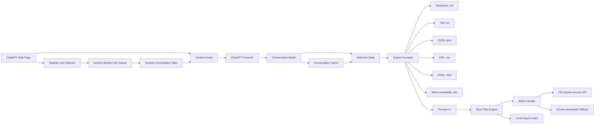
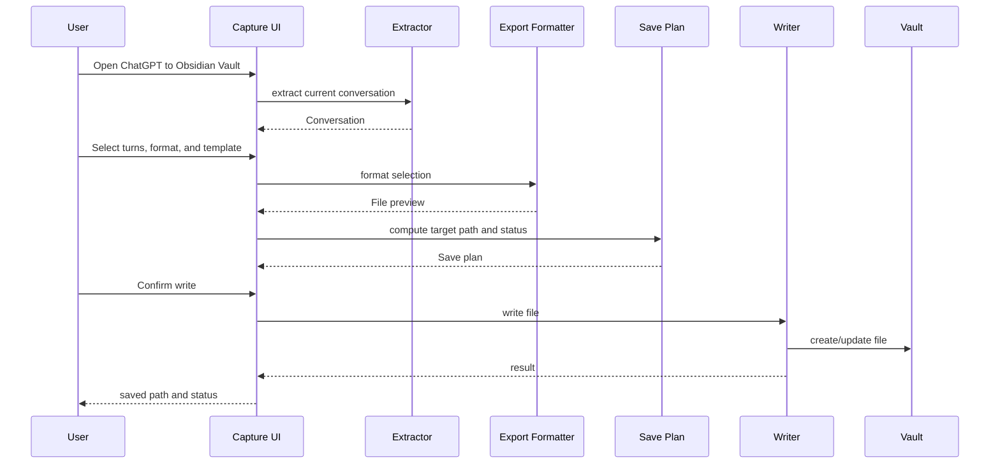
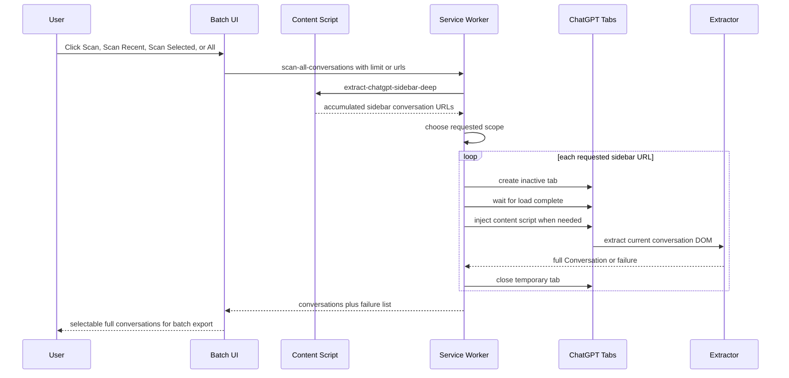
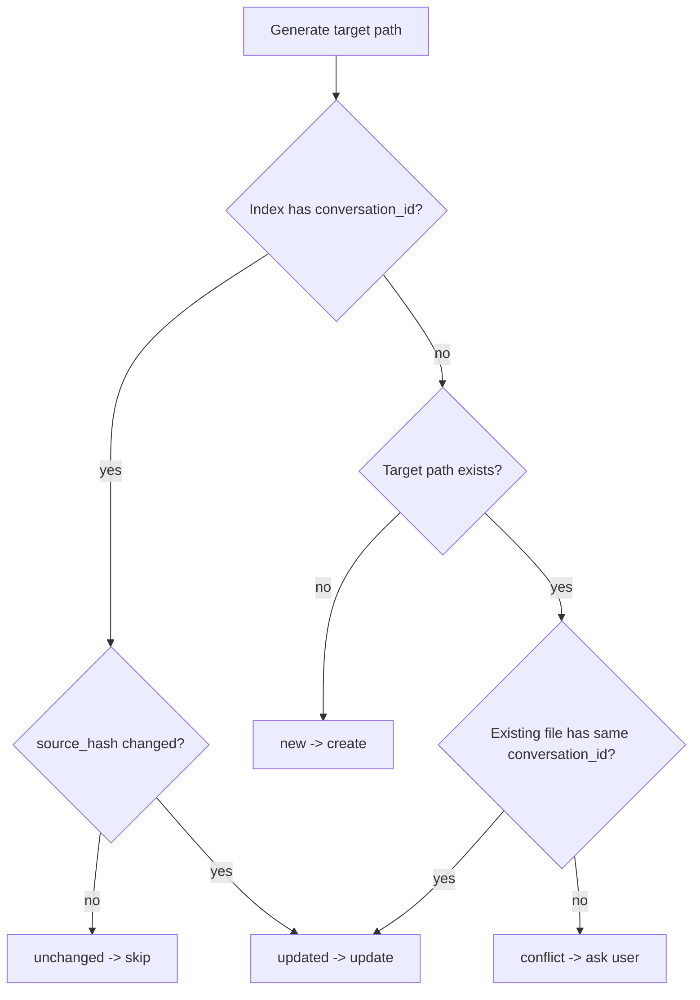

# Architecture: ChatGPT to Obsidian Vault

Status: awaiting docs confirmation.

Date: 2026-05-31.

## 1. Architecture Goals

1. Local-first browser extension.
2. Multi-format export generation.
3. Obsidian-ready Markdown generation remains the strongest destination-specific workflow.
4. Direct Vault writing through explicit user authorization.
5. Stable internal contracts between extraction, selection, formatting, and writing.
6. Testable core logic independent from live ChatGPT DOM.
7. Minimal permissions suitable for Chrome Web Store review.

## 2. Proposed Stack

| Layer | Choice | Notes |
| --- | --- | --- |
| Extension | Chrome Manifest V3 | Primary target: Chrome/Edge |
| Language | TypeScript | Shared types and testable core |
| UI | React | Side panel / popup / in-page workspace |
| Bundler | Vite | Fast extension build |
| Icons | Lucide React | Required by Super Dev constraints |
| Settings | `chrome.storage.local` | Simple preferences |
| File handles | IndexedDB | Store File System Access directory handles |
| Direct writer | File System Access API | Chromium-first |
| Fallback writer | `chrome.downloads` | Downloads-relative path only |
| Tests | Vitest + fixtures | Formatter, parser, path renderer |

## 3. System Overview



## 4. Extension Components

```text
src/
  background/
    service-worker.ts
    batch-orchestrator.ts
    downloads-writer.ts
  content/
    chatgpt-entry.tsx
    conversation-list-adapter.ts
    capture-overlay.tsx
  extractors/
    chatgpt/
      extract-current-conversation.ts
      extract-sidebar-conversations.ts
      normalize-message.ts
      fixtures/
  markdown/
    format-conversation.ts
    frontmatter.ts
    templates.ts
  exporters/
    export-formats.ts
  writers/
    writer-facade.ts
    file-system-access-writer.ts
    downloads-writer-client.ts
    path-template.ts
  storage/
    settings-store.ts
    conversation-cache-store.ts
    directory-handle-store.ts
    export-index-store.ts
  ui/
    components/
    icons.ts
    tokens.ts
  shared/
    types.ts
    errors.ts
    hash.ts
    sanitize.ts
  options/
    OptionsApp.tsx
  sidepanel/
    SidePanelApp.tsx
```

## 5. Core Data Model

```ts
export type ConversationSource = "chatgpt";

export type ConversationStatus =
  | "new"
  | "unchanged"
  | "updated"
  | "conflict"
  | "failed";

export type ConversationSummary = {
  source: ConversationSource;
  id: string | null;
  url: string;
  title: string;
  createdAt?: string;
  updatedAt?: string;
  model?: string;
  messageCount?: number;
  status?: ConversationStatus;
};

export type Conversation = ConversationSummary & {
  messages: ConversationMessage[];
};

export type ExportFormat =
  | "markdown"
  | "text"
  | "json"
  | "csv"
  | "html"
  | "word";

export type ConversationMessage = {
  id: string;
  role: "user" | "assistant" | "system" | "tool" | "unknown";
  authorName?: string;
  createdAt?: string;
  markdown: string;
  plainText: string;
  attachments: ConversationAttachment[];
  sourceNodeHint?: string;
};

export type ConversationAttachment = {
  type: "image" | "file" | "link";
  url?: string;
  filename?: string;
  alt?: string;
};

export type ExportTemplateId =
  | "source_archive"
  | "decision_record"
  | "research_note"
  | "coding_debug";

export type ExportSelection = {
  conversationId: string | null;
  selectedMessageIds: string[];
  templateId: ExportTemplateId;
  exportFormat: ExportFormat;
  includeFrontmatter: boolean;
  includeSourceLink: boolean;
  includeTranscript: boolean;
  tags: string[];
  pathTemplate: string;
  writePolicy: "update" | "copy" | "skip";
};

export type SavePlanItem = {
  conversation: ConversationSummary;
  targetPath: string;
  sourceHash: string;
  status: ConversationStatus;
  reason: string;
};
```

## 6. Message Flow

### Current Conversation Save



### Batch V1: Controlled Scan Queue



Rules:

- The sidebar collector is a discovery mechanism only. It must not claim full content from sidebar rows.
- Summary-only rows surface as "body not yet read" in the UI. They should not render extraction diagnostics as a large warning block.
- Full export requires loading each `https://chatgpt.com/c/...` URL and extracting the conversation page DOM.
- The service worker accepts optional scan controls:
  - `limit`: scan only the first N discovered conversations.
  - `urls`: scan only selected conversation URLs.
  - no limit and no urls: explicit full-history scan.
- The deep collector must accumulate links across scroll positions because ChatGPT may virtualize sidebar rows.
- Temporary tabs are created inactive and closed after extraction to keep the user on the current ChatGPT page.
- Failures are preserved with URL, title, and reason so the user can retry manually.
- Summary-only conversations remain selectable so the user can choose them before extracting full text with `Scan Selected`.
- Message selection has no model-backed quality score in MVP. UI controls are limited to deterministic all / clear / manual selection.

## 7. File Writing Architecture

### Writer Facade

The UI talks to a single writer facade:

```ts
type Writer = {
  canWriteDirectly(): Promise<boolean>;
  ensurePermission(): Promise<PermissionResult>;
  writeMarkdown(input: WriteMarkdownInput): Promise<WriteResult>;
};
```

The facade selects:

1. File System Access writer when available and authorized.
2. Downloads writer when direct write is unavailable or denied.

### File System Access Writer

Responsibilities:

- request directory through `showDirectoryPicker({ mode: "readwrite" })`
- persist directory handle in IndexedDB
- query/request permission before write
- create nested folders
- write files atomically where practical
- read existing files for frontmatter/index checks when permission allows

Important constraint:

- Folder selection must happen from a user gesture.

### Downloads Writer

Responsibilities:

- create Blob URL
- call background service worker to use `chrome.downloads.download`
- use relative filename only
- report that output goes under browser Downloads

Important constraint:

- `chrome.downloads` cannot write arbitrary absolute paths.
- Downloads fallback means Chrome writes under the browser's configured Downloads directory. Direct Obsidian writing requires the user to click `Choose Vault`, grant File System Access permission, and keep that permission active.

## 7.1 Scan Message Contract

Side panel to service worker:

```ts
type ScanAllMessage = {
  type: "scan-all-conversations";
  limit?: number;
  urls?: string[];
};
```

Service worker response:

```ts
type ScanAllResponse = {
  ok: boolean;
  conversations: Conversation[];
  summaries: ConversationSummary[];
  requested: number;
  failures: Array<{ url: string; title: string; reason: string }>;
  reason?: string;
};
```

Behavior:

- `summaries` always describes all discovered sidebar rows, not only extracted rows.
- `requested` describes the number of conversations the queue attempted for the chosen scope.
- The UI merges extracted conversations with summary-only rows and prefers the extracted version when both exist.

## 8. Export Index

The export index improves update detection without scanning the whole vault every time.

## 8.1 Conversation Cache

The conversation cache stores the latest discovered and extracted conversations in browser-local storage.

Purpose:

- restore the conversation list after the side panel reloads
- avoid losing sidebar discovery results after Chrome suspends the extension view
- keep summary-only rows available for later `Scan Selected`

Cache behavior:

- write after conversation list changes
- restore on side panel boot
- restore does not auto-select every cached row; selection is an explicit user action
- keep only local browser data
- cap cached conversation count and preserve the latest rows first
- when browser storage quota is tight, retain sidebar metadata and progressively reduce cached full transcripts instead of throwing a UI error
- expose a UI action to clear the cache

Current implementation:

```ts
type ConversationCache = {
  cachedAt: string;
  conversations: Conversation[];
};
```

The side panel uses `localStorage` for the first local cache pass because it is synchronous and scoped to the extension origin. If cache size becomes a product bottleneck, the next architecture step is moving this store to IndexedDB or `chrome.storage.local` with explicit quota reporting.

Export index store:

```ts
type ExportIndexRecord = {
  conversationId: string;
  sourceUrl: string;
  targetPath: string;
  title: string;
  sourceHash: string;
  exportedAt: string;
  templateId: ExportTemplateId;
  exportFormat: ExportFormat;
};
```

Storage:

- IndexedDB for structured records.
- Optional `.chatvault/index.json` in the Vault later if user opts in.

Index lookup order:

1. Local export index by `conversationId`, `targetPath`, and `exportFormat`.
2. Existing target file frontmatter if file can be read.
3. Path collision detection.

## 9. Save Judgment



Hash input:

- normalized selected message IDs
- normalized Markdown body
- source URL
- template ID if template changes output semantics

## 10. ChatGPT Extraction Strategy

Extraction should be defensive because ChatGPT DOM changes.

Priority order:

1. stable attributes when available
2. semantic role-like structure
3. visible message grouping
4. code/pre extraction before text flattening
5. fallback text extraction with diagnostic warning

Extractor output must never include:

- ChatGPT navigation chrome
- input composer text unless part of conversation
- hidden menus/tooltips
- extension UI text

Testing:

- keep sanitized HTML fixtures
- unit test extractor against fixtures
- test code block preservation
- test long conversations
- test empty/streaming states

## 11. Permissions

### MVP Manifest Permissions

Likely:

```json
{
  "permissions": ["storage", "downloads", "sidePanel"],
  "host_permissions": ["https://chatgpt.com/*"]
}
```

Potential:

- `activeTab` if programmatic injection is used
- `scripting` if injecting programmatically instead of static content script

Avoid:

- `<all_urls>`
- broad browsing history permissions
- remote code
- unnecessary tabs permission unless batch opened-tabs mode requires it

## 12. Privacy Boundary

Conversation content is handled locally:

- content script reads ChatGPT page only when user opens/uses capture
- formatter runs locally
- writer writes locally
- no server in MVP
- no analytics in MVP
- optional integrations must be explicitly enabled later

Privacy policy must say:

- what pages are read
- what content is processed
- where content is stored
- that content is not transmitted in MVP
- how users can delete local settings/index

## 13. Error Model

Use typed errors:

```ts
type ChatGPT to Obsidian VaultErrorCode =
  | "EXTRACTOR_NO_CONVERSATION"
  | "EXTRACTOR_PARTIAL_CONTENT"
  | "VAULT_PERMISSION_DENIED"
  | "VAULT_PERMISSION_EXPIRED"
  | "WRITE_FAILED"
  | "DOWNLOADS_FALLBACK_USED"
  | "PATH_CONFLICT"
  | "UNSUPPORTED_BROWSER";
```

Each error shown to user must include:

- what happened
- what file/conversation was affected
- what action can fix it

## 14. Testing Strategy

### Unit Tests

- path template rendering
- filename sanitization
- YAML escaping
- frontmatter generation
- source hash stability
- Markdown formatter
- save judgment

### Fixture Tests

- ChatGPT normal chat
- ChatGPT long chat
- ChatGPT code-heavy chat
- ChatGPT project conversation if extractable
- ChatGPT group chat later

### Integration Tests

- extract -> select -> format -> save plan
- direct writer mock
- downloads fallback mock
- index update

### Manual QA

- load unpacked extension
- open ChatGPT current conversation
- choose test Vault folder
- write source file
- re-export unchanged conversation
- modify selection and re-export
- simulate permission denied
- simulate Downloads fallback

## 15. Implementation Order After Confirmation

1. Initialize Vite + React + TypeScript MV3 extension.
2. Declare Lucide icons and design tokens before UI code.
3. Implement shared types.
4. Implement export formatter, markdown/frontmatter/path/hash utilities.
5. Implement static fixture tests.
6. Implement current conversation extractor.
7. Implement three-panel UI shell.
8. Implement preview.
9. Implement File System Access writer.
10. Implement Downloads fallback.
11. Implement save plan/index.
12. Implement batch V1.

No implementation should start until the user confirms the docs.
